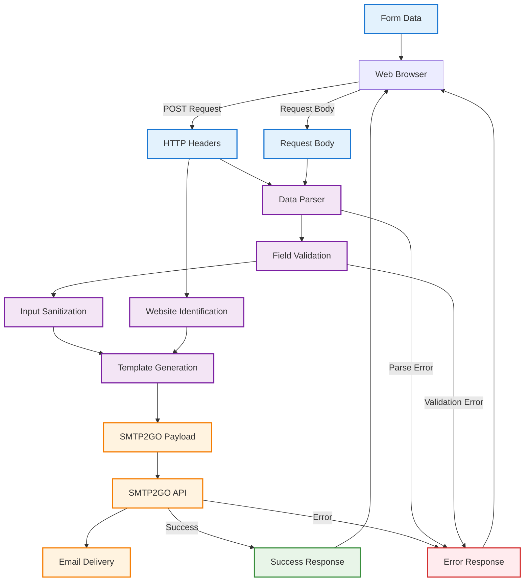

# Data Flow Diagram

This diagram shows how data flows through the cf-mailer system from form submission to email delivery.



## Data Transformation Stages

### 1. Input Data Collection

#### Form Fields
- **name**: Contact person's name (required)
- **email**: Contact email address (required, validated)
- **message**: Message content (required, length limited)
- **subject**: Email subject line (optional, defaults to "Contact Form Submission")

#### HTTP Context
- **Content-Type**: Determines parsing strategy
- **Referer**: Identifies source website
- **Origin**: CORS validation reference

### 2. Data Parsing & Extraction

#### Content Type Handling
- **JSON**: Direct object property access
- **Form Encoded**: URL decode and parse key-value pairs
- **Multipart**: Parse boundaries and extract field data

#### Error Cases
- Malformed JSON syntax
- Invalid URL encoding
- Corrupted multipart boundaries

### 3. Validation & Sanitization

#### Field Validation
- Required field presence check
- Email format validation using regex
- Message length limits (configurable)

#### Security Processing
- HTML entity encoding for XSS prevention
- Whitespace trimming and normalization
- Input length restrictions

### 4. Metadata Enrichment

#### Website Identification
- Extract hostname from Referer header
- Parse full URL for context
- Fallback to "Unknown Website" if unavailable

#### Timestamp Addition
- Current datetime in readable format
- Timezone handling (UTC default)

### 5. Email Template Generation

#### HTML Template
```html
<h2>New Contact Form Submission</h2>
<p><strong>Website:</strong> {website}</p>
<p><strong>Name:</strong> {name}</p>
<p><strong>Email:</strong> {email}</p>
<p><strong>Subject:</strong> {subject}</p>
<p><strong>Message:</strong><br>{message}</p>
<p><em>Submitted: {timestamp}</em></p>
```

#### Plain Text Template
```text
New Contact Form Submission

Website: {website}
Name: {name}
Email: {email}
Subject: {subject}

Message:
{message}

Submitted: {timestamp}
```

### 6. SMTP Payload Construction

#### SMTP2GO API Format
```json
{
  "api_key": "{{SMTP2GO_API_KEY}}",
  "to": ["{{TO_EMAIL}}"],
  "sender": "{{FROM_EMAIL}}",
  "subject": "{{subject}}",
  "html_body": "{{html_template}}",
  "text_body": "{{text_template}}",
  "custom_headers": [
    {
      "header": "Reply-To",
      "value": "{{email}}"
    }
  ]
}
```

## Data Security Measures

### Input Sanitization
- HTML entity encoding prevents XSS attacks
- Length limits prevent resource exhaustion
- Type validation ensures data integrity

### Content Security
- No user data stored permanently
- Minimal data retention in memory
- Secure transmission to SMTP service

### Privacy Protection
- No logging of personal information
- Direct relay without intermediate storage
- Configurable recipient restriction