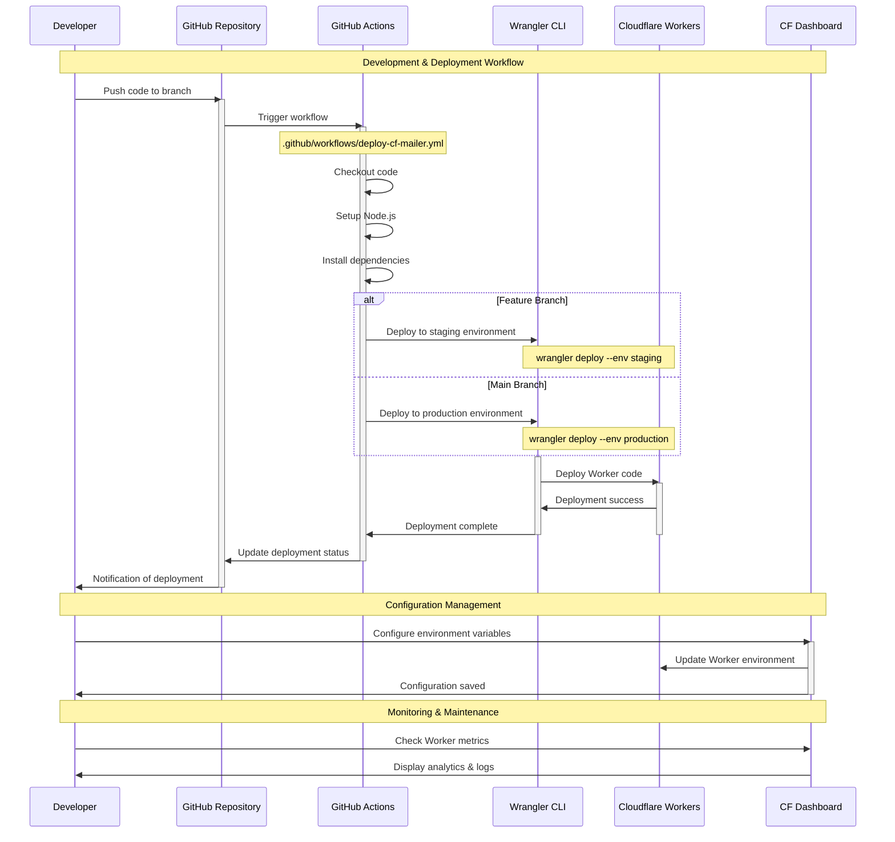

# Deployment Pipeline

This diagram illustrates the CI/CD process for deploying cf-mailer to Cloudflare Workers.

## Pipeline Components

### Source Control

- **GitHub Repository**: Version control and collaboration
- **Branch Protection**: Main branch requires PR approval
- **Automated Triggers**: Push and PR events start deployments

### CI/CD Pipeline

- **GitHub Actions**: Serverless CI/CD automation
- **Workflow Configuration**: `.github/workflows/deploy-cf-mailer.yml`
- **Environment Strategy**: Separate staging and production environments

### Deployment Tool

- **Wrangler CLI**: Official Cloudflare Workers deployment tool
- **Configuration**: `wrangler.toml` defines Worker settings
- **Authentication**: GitHub secrets store CF API credentials

### Target Platform

- **Cloudflare Workers**: Serverless execution environment
- **Global Distribution**: Automatic deployment to edge locations
- **Environment Variables**: Runtime configuration via CF Dashboard

## Deployment Environments

### Staging Environment

- **Trigger**: Feature branch pushes
- **Purpose**: Testing and validation before production
- **Configuration**: Separate environment variables and settings

### Production Environment

- **Trigger**: Main branch pushes (typically via merged PRs)
- **Purpose**: Live contact form processing
- **Configuration**: Production API keys and email settings

## Security & Configuration

### Secrets Management

- **GitHub Secrets**: Store sensitive Cloudflare credentials
- **Environment Variables**: Configure via Cloudflare Dashboard
- **API Keys**: SMTP2GO and other service credentials

### Required Configuration

- `CLOUDFLARE_API_TOKEN`: Deployment authentication
- `CLOUDFLARE_ACCOUNT_ID`: Target Cloudflare account
- `SMTP2GO_API_KEY`: Email service authentication
- `TO_EMAIL`: Recipient email address

## Monitoring & Maintenance

### Deployment Verification

- Automatic deployment status updates
- Worker health checks post-deployment
- Error notifications for failed deployments

### Operational Monitoring

- Cloudflare Dashboard analytics
- Request volume and response time metrics
- Error rate and success rate tracking