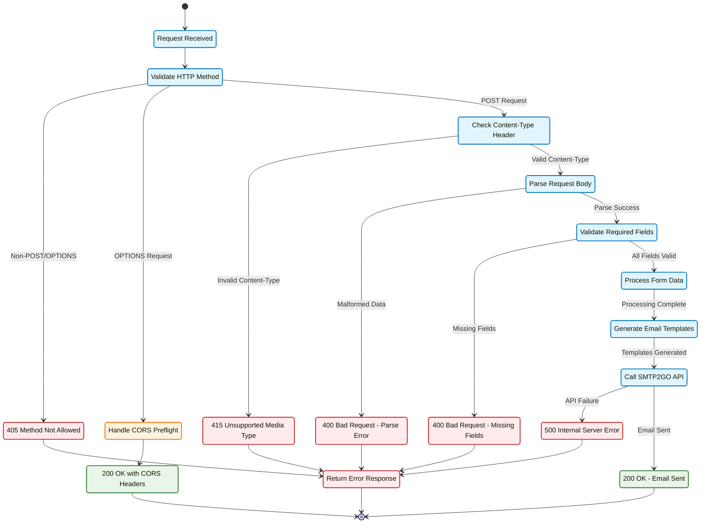

# Error Handling States

This diagram shows the different error states and transitions in the cf-mailer request processing lifecycle.

## Error Categories

### Client Errors (4xx)

#### 400 Bad Request

- **Parse Error**: Malformed JSON, form data, or multipart data
- **Validation Error**: Missing required fields (name, email, message)
- **Data Error**: Invalid field values or excessive length

#### 405 Method Not Allowed

- **Trigger**: Request methods other than POST or OPTIONS
- **Response**: JSON error with allowed methods
- **Headers**: Includes CORS headers for cross-origin requests

#### 415 Unsupported Media Type

- **Trigger**: Content-Type not in supported list
- **Supported Types**: 
  - `application/json`
  - `application/x-www-form-urlencoded`
  - `multipart/form-data`

### Server Errors (5xx)

#### 500 Internal Server Error

- **SMTP API Failure**: SMTP2GO service unavailable or authentication error
- **Network Issues**: Connectivity problems with external services
- **Configuration Error**: Missing or invalid environment variables

### Success Responses (2xx)

#### 200 OK - CORS Preflight

- **Trigger**: OPTIONS request for CORS validation
- **Headers**: Access-Control-Allow-* headers
- **Purpose**: Browser preflight request handling

#### 200 OK - Email Sent

- **Trigger**: Successful email delivery via SMTP2GO
- **Response**: Success confirmation with message
- **Headers**: CORS headers for cross-origin requests

## Error Recovery Patterns

### Graceful Degradation

- All errors include CORS headers for browser compatibility
- Structured JSON responses for consistent client handling
- Descriptive error messages for debugging

### Input Validation Strategy

- Progressive validation (method → content-type → fields)
- Early return on validation failures
- Sanitization before processing

### External Service Resilience

- Timeout handling for SMTP2GO API calls
- Structured error responses for service failures
- Retry logic considerations for transient failures

## Monitoring & Alerting

### Error Rate Tracking

- Monitor 4xx rates for client integration issues
- Track 5xx rates for service reliability
- Alert on SMTP delivery failure spikes

### Common Error Patterns

- **High 405 rates**: Incorrect integration (using GET instead of POST)
- **High 415 rates**: Content-Type header issues
- **High 400 rates**: Form validation problems
- **High 500 rates**: SMTP2GO service or configuration issues