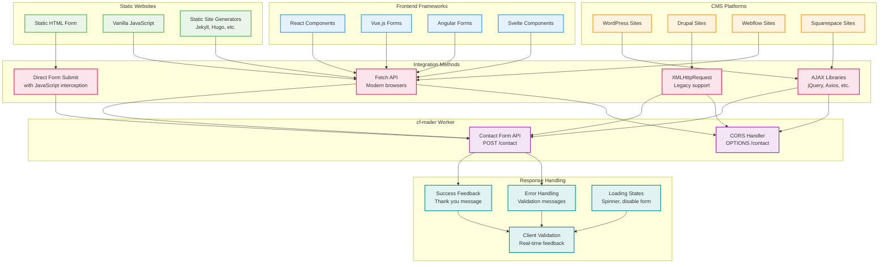

# Integration Patterns

This diagram shows common integration patterns and implementations for different website types using cf-mailer.



## Implementation Examples

### 1. Vanilla JavaScript Integration

```javascript
// Basic form submission with Fetch API
async function submitContactForm(event) {
  event.preventDefault();
  
  const formData = new FormData(event.target);
  const data = Object.fromEntries(formData);
  
  try {
    const response = await fetch('https://your-worker.your-domain.workers.dev/', {
      method: 'POST',
      headers: {
        'Content-Type': 'application/json',
      },
      body: JSON.stringify(data)
    });
    
    const result = await response.json();
    
    if (response.ok) {
      showSuccessMessage(result.message);
      event.target.reset();
    } else {
      showErrorMessage(result.error);
    }
  } catch (error) {
    showErrorMessage('Network error. Please try again.');
  }
}

document.getElementById('contactForm').addEventListener('submit', submitContactForm);
```

### 2. React Component Integration

```jsx
import React, { useState } from 'react';

function ContactForm() {
  const [formData, setFormData] = useState({
    name: '',
    email: '',
    message: '',
    subject: ''
  });
  const [loading, setLoading] = useState(false);
  const [status, setStatus] = useState({ type: '', message: '' });

  const handleSubmit = async (e) => {
    e.preventDefault();
    setLoading(true);
    
    try {
      const response = await fetch('/api/contact', {
        method: 'POST',
        headers: { 'Content-Type': 'application/json' },
        body: JSON.stringify(formData)
      });
      
      const result = await response.json();
      
      if (response.ok) {
        setStatus({ type: 'success', message: 'Message sent successfully!' });
        setFormData({ name: '', email: '', message: '', subject: '' });
      } else {
        setStatus({ type: 'error', message: result.error || 'Failed to send message' });
      }
    } catch (error) {
      setStatus({ type: 'error', message: 'Network error. Please try again.' });
    } finally {
      setLoading(false);
    }
  };

  return (
    <form onSubmit={handleSubmit} className="contact-form">
      {/* Form fields */}
      <button type="submit" disabled={loading}>
        {loading ? 'Sending...' : 'Send Message'}
      </button>
      {status.message && (
        <div className={`message ${status.type}`}>{status.message}</div>
      )}
    </form>
  );
}
```

### 3. WordPress Integration

```javascript
// WordPress theme integration using jQuery
jQuery(document).ready(function($) {
  $('#contact-form').on('submit', function(e) {
    e.preventDefault();
    
    const $form = $(this);
    const $submitBtn = $form.find('[type="submit"]');
    const originalText = $submitBtn.text();
    
    // Show loading state
    $submitBtn.text('Sending...').prop('disabled', true);
    
    // Prepare form data
    const formData = {
      name: $form.find('[name="name"]').val(),
      email: $form.find('[name="email"]').val(),
      message: $form.find('[name="message"]').val(),
      subject: $form.find('[name="subject"]').val() || 'Contact Form Submission'
    };
    
    // Submit to cf-mailer
    $.ajax({
      url: 'https://your-worker.your-domain.workers.dev/',
      method: 'POST',
      contentType: 'application/json',
      data: JSON.stringify(formData),
      success: function(response) {
        $form.before('<div class="success-message">Thank you! Your message has been sent.</div>');
        $form[0].reset();
      },
      error: function(xhr) {
        const error = xhr.responseJSON ? xhr.responseJSON.error : 'Failed to send message';
        $form.before('<div class="error-message">' + error + '</div>');
      },
      complete: function() {
        $submitBtn.text(originalText).prop('disabled', false);
      }
    });
  });
});
```

### 4. Static Site Generator Integration

```html
<!-- Jekyll/Hugo static form -->
<form id="contactForm" action="#" method="post">
  <input type="text" name="name" required placeholder="Your Name">
  <input type="email" name="email" required placeholder="Your Email">
  <input type="text" name="subject" placeholder="Subject">
  <textarea name="message" required placeholder="Your Message"></textarea>
  <button type="submit">Send Message</button>
  <div id="form-status"></div>
</form>

<script>
document.getElementById('contactForm').addEventListener('submit', async function(e) {
  e.preventDefault();
  
  const status = document.getElementById('form-status');
  const formData = new FormData(this);
  
  // Convert FormData to JSON
  const data = {};
  formData.forEach((value, key) => data[key] = value);
  
  try {
    status.innerHTML = '<p class="loading">Sending...</p>';
    
    const response = await fetch('{{ site.contact_form_endpoint }}', {
      method: 'POST',
      headers: { 'Content-Type': 'application/json' },
      body: JSON.stringify(data)
    });
    
    if (response.ok) {
      status.innerHTML = '<p class="success">Message sent successfully!</p>';
      this.reset();
    } else {
      const error = await response.json();
      status.innerHTML = `<p class="error">${error.error || 'Failed to send'}</p>`;
    }
  } catch (error) {
    status.innerHTML = '<p class="error">Network error. Please try again.</p>';
  }
});
</script>
```

## CORS Configuration Examples

### Development Environment
```javascript
// Allow all origins for development
const corsHeaders = {
  'Access-Control-Allow-Origin': '*',
  'Access-Control-Allow-Methods': 'POST, OPTIONS',
  'Access-Control-Allow-Headers': 'Content-Type'
};
```

### Production Environment
```javascript
// Restrict to specific domains
const allowedOrigins = [
  'https://example.com',
  'https://www.example.com',
  'https://blog.example.com'
];

const corsHeaders = {
  'Access-Control-Allow-Origin': allowedOrigins.includes(origin) ? origin : 'null',
  'Access-Control-Allow-Methods': 'POST, OPTIONS',
  'Access-Control-Allow-Headers': 'Content-Type'
};
```

## Error Handling Patterns

### User-Friendly Error Messages
```javascript
const errorMessages = {
  400: 'Please fill in all required fields.',
  415: 'Invalid form data format.',
  429: 'Too many requests. Please wait before submitting again.',
  500: 'Server error. Please try again later.',
  default: 'An unexpected error occurred. Please try again.'
};

function handleError(response) {
  const message = errorMessages[response.status] || errorMessages.default;
  showErrorMessage(message);
}
```

### Validation Feedback
```javascript
function validateForm(data) {
  const errors = [];
  
  if (!data.name || data.name.trim().length < 2) {
    errors.push('Name must be at least 2 characters long.');
  }
  
  if (!data.email || !isValidEmail(data.email)) {
    errors.push('Please enter a valid email address.');
  }
  
  if (!data.message || data.message.trim().length < 10) {
    errors.push('Message must be at least 10 characters long.');
  }
  
  return errors;
}
```

## Progressive Enhancement

### No-JavaScript Fallback
```html
<!-- Form works without JavaScript -->
<form action="mailto:contact@example.com" method="post" enctype="text/plain">
  <!-- Form fields -->
  <noscript>
    <p>JavaScript is disabled. This form will open your email client.</p>
  </noscript>
</form>
```

### Enhanced with JavaScript
```javascript
// Enhance form when JavaScript is available
if ('fetch' in window) {
  // Use modern fetch API
  enhanceFormWithFetch();
} else if ('XMLHttpRequest' in window) {
  // Fallback to XMLHttpRequest
  enhanceFormWithXHR();
}
```