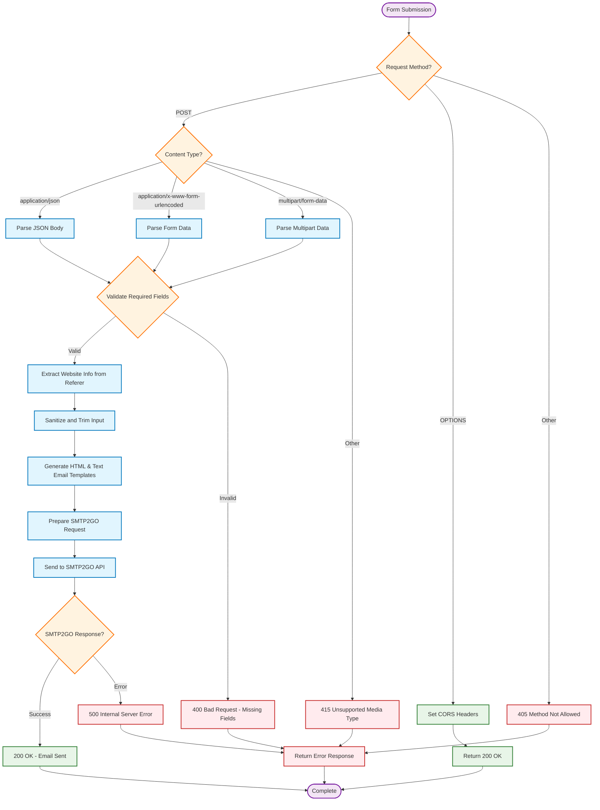

# Request Processing Flow

This diagram shows the complete flow of how cf-mailer processes contact form submissions from initial request to email delivery.

## Key Process Steps

### 1. Request Method Validation

- Only POST requests are processed for form submissions
- OPTIONS requests return CORS headers for preflight
- Other methods return 405 Method Not Allowed

### 2. Content Type Processing

The worker supports multiple form submission formats:

- **JSON**: `application/json` - Direct JSON payload
- **Form Encoded**: `application/x-www-form-urlencoded` - Standard form submission  
- **Multipart**: `multipart/form-data` - File uploads and complex forms

### 3. Data Validation

Required fields are validated based on configuration:

- Default required fields: `name`, `email`, `message`
- Configurable via `REQUIRED_FIELDS` environment variable
- Returns 400 Bad Request if validation fails

### 4. Website Identification

- Extracts website information from `Referer` header
- Adds source identification to email templates
- Helps identify which website sent the form submission

### 5. Input Processing

- Sanitizes all user input to prevent XSS
- Trims whitespace from form fields
- Limits message length to prevent abuse

### 6. Email Generation

- Creates both HTML and plain text versions
- Includes website identification and timestamp
- Preserves Reply-To functionality for direct responses

### 7. SMTP2GO Integration

- Sends email via SMTP2GO REST API
- Handles authentication and delivery
- Returns appropriate success/error responses

## Error Handling

The system provides comprehensive error responses:

- **405**: Method not allowed (non-POST/OPTIONS)
- **415**: Unsupported content type
- **400**: Validation errors (missing fields)
- **500**: SMTP delivery errors

All error responses include CORS headers and structured JSON format.