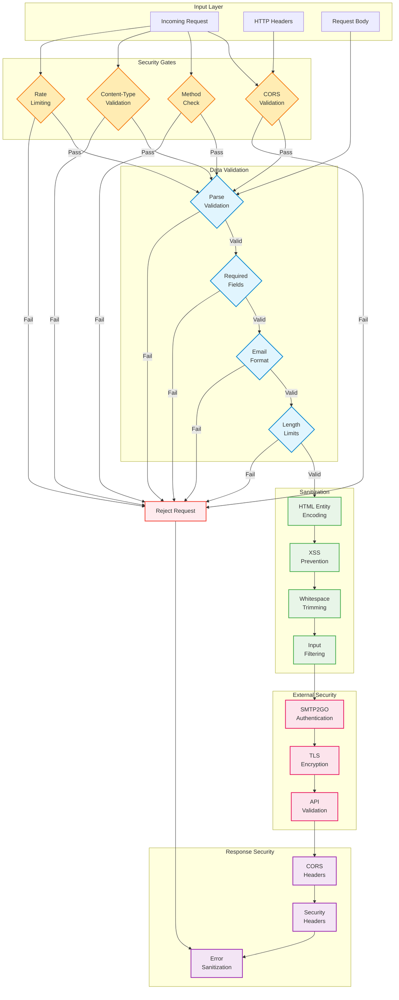

# Security & Validation Process

This diagram illustrates the comprehensive security and validation measures implemented in cf-mailer.



## Security Implementation Layers

### 1. Request-Level Security

#### CORS (Cross-Origin Resource Sharing)
- **Origin Validation**: Check against allowed origins list
- **Preflight Handling**: Respond to OPTIONS requests appropriately
- **Header Configuration**: Set proper Access-Control-* headers
- **Wildcard Control**: Configurable origin restrictions

```javascript
// CORS Configuration Example
const allowedOrigins = env.ALLOWED_ORIGINS 
  ? env.ALLOWED_ORIGINS.split(',') 
  : ['*'];

const corsHeaders = {
  'Access-Control-Allow-Origin': origin,
  'Access-Control-Allow-Methods': 'POST, OPTIONS',
  'Access-Control-Allow-Headers': 'Content-Type',
  'Access-Control-Max-Age': '86400'
};
```

#### Method Validation
- **POST Only**: Contact form submissions via POST method
- **OPTIONS Support**: CORS preflight requests
- **Method Rejection**: Return 405 for other HTTP methods

#### Content-Type Validation
- **Supported Types**: JSON, form-encoded, multipart
- **Type Checking**: Validate Content-Type header
- **Rejection Handling**: 415 Unsupported Media Type

### 2. Data Validation & Sanitization

#### Input Validation
- **Required Fields**: Configurable field requirements
- **Email Format**: Regex-based email validation
- **Length Limits**: Prevent resource exhaustion
- **Type Checking**: Ensure proper data types

#### XSS Prevention
```javascript
function escapeHtml(text) {
  const map = {
    '&': '&amp;',
    '<': '&lt;',
    '>': '&gt;',
    '"': '&quot;',
    "'": '&#039;'
  };
  return text.replace(/[&<>"']/g, m => map[m]);
}
```

#### Input Sanitization
- **HTML Encoding**: Prevent script injection
- **Whitespace Trimming**: Clean input formatting
- **Length Enforcement**: Configurable maximum lengths
- **Special Character Handling**: Safe character encoding

### 3. External Service Security

#### SMTP2GO Authentication
- **API Key Management**: Secure credential handling
- **Environment Variables**: Keep secrets out of code
- **Request Signing**: Authenticate API calls

#### Transport Security
- **TLS Encryption**: All external API calls over HTTPS
- **Certificate Validation**: Verify service certificates
- **Secure Headers**: Content-Type, User-Agent validation

### 4. Rate Limiting & Abuse Prevention

#### Request Rate Limiting
- **IP-based Limits**: Prevent spam from single sources
- **Time Windows**: Configurable rate windows
- **Backoff Strategies**: Progressive delays for repeated violations

#### Content Limits
- **Message Length**: Maximum message size limits
- **Field Count**: Prevent form field flooding
- **Request Size**: Overall payload size restrictions

### 5. Error Handling Security

#### Information Disclosure Prevention
- **Generic Error Messages**: No sensitive data in errors
- **Stack Trace Filtering**: Remove internal details
- **Consistent Response Format**: Standard error structure

#### Error Response Security
```json
{
  "success": false,
  "error": "Validation failed",
  "details": ["Email is required", "Message is required"]
}
```

## Security Configuration

### Environment Variables

#### Required Security Settings
- `SMTP2GO_API_KEY`: Email service authentication
- `TO_EMAIL`: Destination email address
- `ALLOWED_ORIGINS`: CORS origin whitelist

#### Optional Security Settings
- `REQUIRED_FIELDS`: Customizable validation rules
- `MAX_MESSAGE_LENGTH`: Content length limits
- `RATE_LIMIT_WINDOW`: Rate limiting configuration

### Security Headers
- **Content-Type**: Ensure proper response types
- **CORS Headers**: Cross-origin security
- **Cache-Control**: Prevent response caching
- **X-Content-Type-Options**: MIME type sniffing protection

## Threat Mitigation

### Cross-Site Scripting (XSS)
- HTML entity encoding for all user input
- Content-Type validation
- No dynamic script generation

### Cross-Site Request Forgery (CSRF)
- CORS validation for cross-origin requests
- Content-Type verification
- No state-changing GET requests

### Injection Attacks
- Input sanitization and validation
- Parameterized external API calls
- No dynamic code execution

### Denial of Service (DoS)
- Request rate limiting
- Content size limits
- Timeout configuration for external calls

### Data Leakage
- Minimal error information disclosure
- No logging of sensitive data
- Secure external service communication