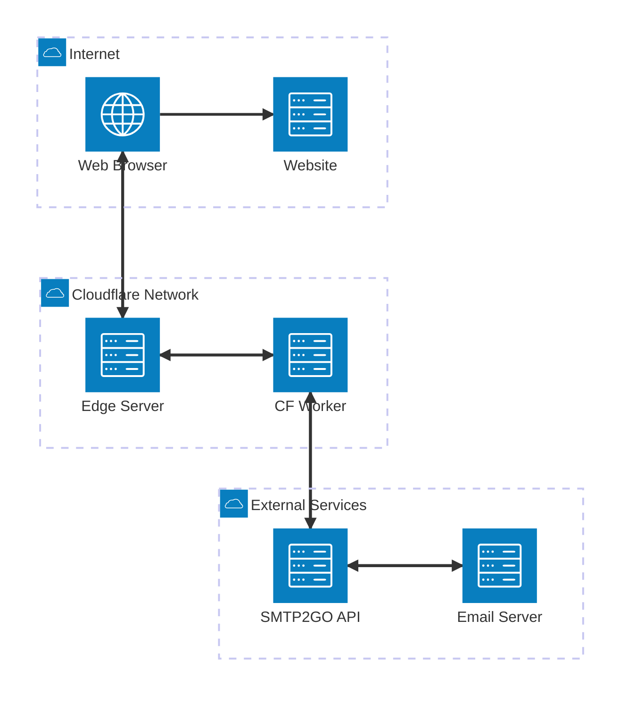

# System Architecture

This diagram shows the high-level architecture of the cf-mailer system and its key components.

## Architecture Components

### Internet Layer

- **Web Browser**: User's client submitting contact forms
- **Website**: Origin website containing the contact form

### Cloudflare Network

- **Edge Server**: Cloudflare's global CDN handling requests
- **CF Worker**: The cf-mailer serverless function processing form submissions

### External Services

- **SMTP2GO API**: Email delivery service handling SMTP
- **Email Server**: Destination email server (recipient's provider)

## Data Flow

### 1. Form Submission Flow

1. User fills out contact form on website
2. Browser sends POST request to Cloudflare edge
3. Edge routes request to cf-mailer Worker
4. Worker processes and validates form data

### 2. Email Delivery Flow

1. Worker generates email templates (HTML/text)
2. Worker calls SMTP2GO API with email payload
3. SMTP2GO delivers email to recipient's email server
4. Response flows back through the chain

## Key Features

### Cloudflare Workers Benefits

- **Global Distribution**: Runs at 200+ edge locations worldwide
- **Low Latency**: Executes close to users for fast response times
- **Serverless**: No infrastructure management required
- **Scalability**: Automatically handles traffic spikes

### Security & Reliability

- **CORS Protection**: Configurable origin validation
- **Input Sanitization**: XSS protection and data validation
- **Rate Limiting**: Built-in abuse prevention
- **Error Handling**: Comprehensive error responses

### Email Integration

- **SMTP2GO**: Professional email delivery service
- **Multiple Formats**: HTML and plain text email generation
- **Reply-To Support**: Direct response capability
- **Website Identification**: Source tracking via Referer headers